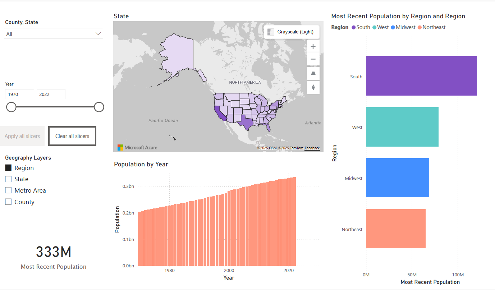

📊 US Population Power BI Dashboard Report

A comprehensive, interactive analysis of U.S. population trends and regional distribution.

📌 Overview

The US Population Power BI Dashboard provides an interactive and visually clear view of the population distribution across the United States. It offers regional, state, and metro-level insights over time, leveraging powerful visualization tools and Azure Maps integration to support analysis and decision-making.

🗺️ Key Features
1. Population Data by Region

Displays population distribution across the four main U.S. regions:
South, West, Midwest, Northeast

A bar chart provides a quick comparison of population sizes between these regions.

2. Population Over Time (1970–2022)

A year-wise time-series visualization illustrates population growth trends.

Helps identify significant increases or decreases over specific periods.

Useful for trend analysis, forecasting, and demographic research.

3. Azure Maps Integration

Interactive Azure Maps visualization using OSM and TomTom layers.

Users can hover over or click on states or regions for more detailed population data.

Offers multi-level geographic insights.

🎛️ Filters & Interactivity
Year Filter

Select any year between 1970 and 2022 to view population data for that specific period.

Filters option
Filter by:Region, State, Metro Area
Enables detailed drill-down to more granular population information.
Reset Filters
Clear all filters option allows users to easily return to the default unfiltered view.
Clear Slicers
Single-click option to reset all slicers for a fresh start.

📈 Interactive Charts & Visual Design

Dashboard uses grayscale light tones for a clean, modern look.

Population values are displayed on visual scales for quick comparison across regions and states.

All charts are interactive, intuitive, and optimized for clarity.

🔍 Drill-Down Capabilities

Click on a region (e.g., South, West) to reveal each state's population data.

Further drill-down leads to county or metro-level details.

Supports multi-layered demographic exploration.

🧠 Skills Demonstrated

- Data Analysis & Visualization
- Business Intelligence Reporting
- Power BI Dashboard Design
- Geospatial Analytics (Azure Maps)
- Interactive Filtering & Drill-Down Modeling
